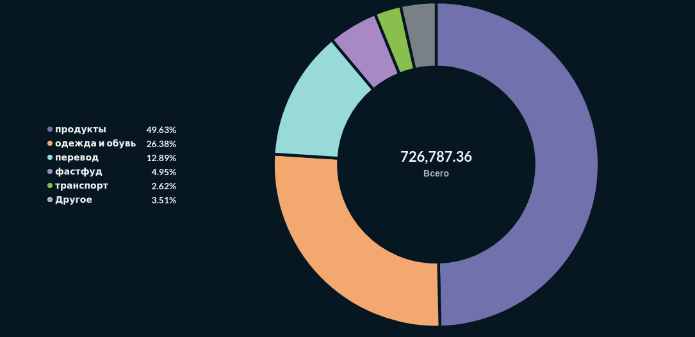
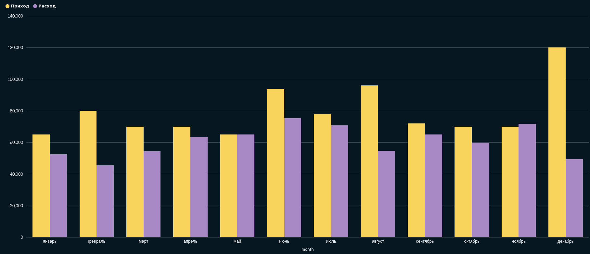
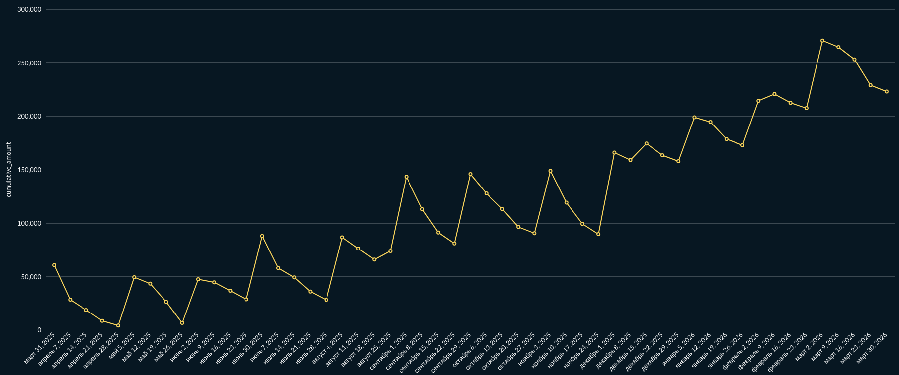
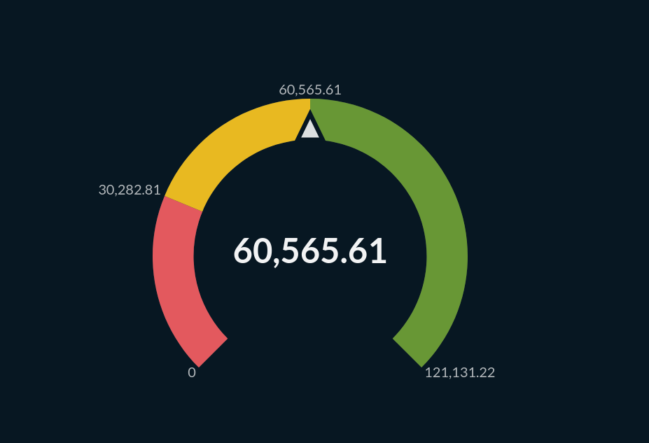
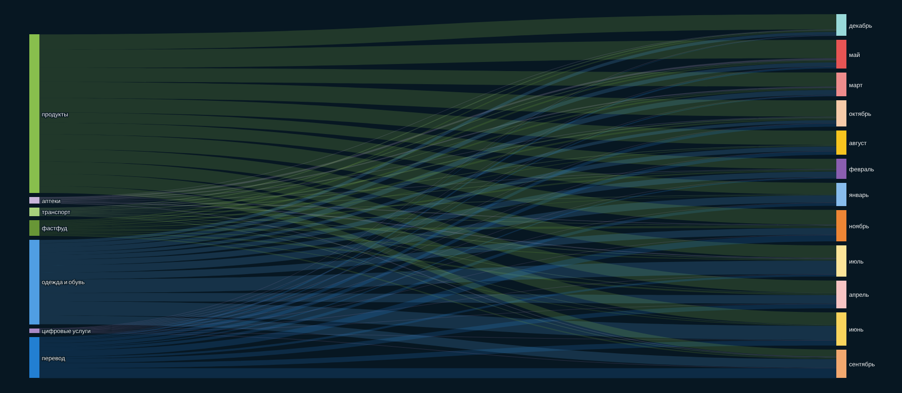
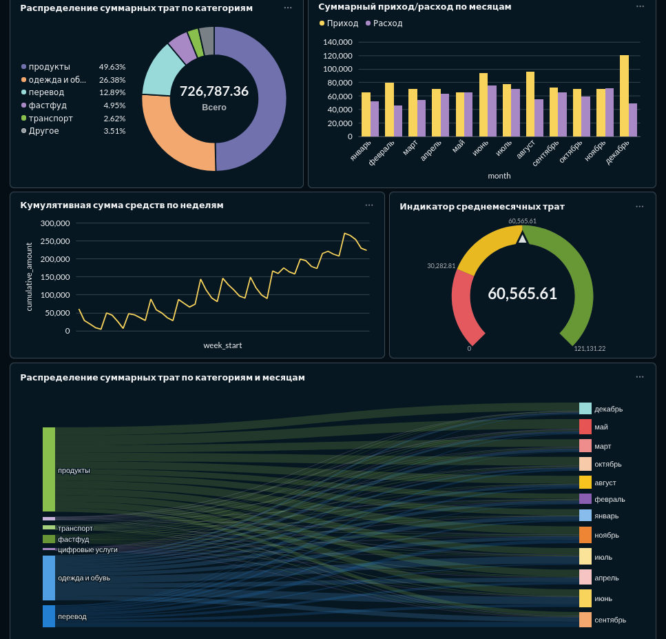
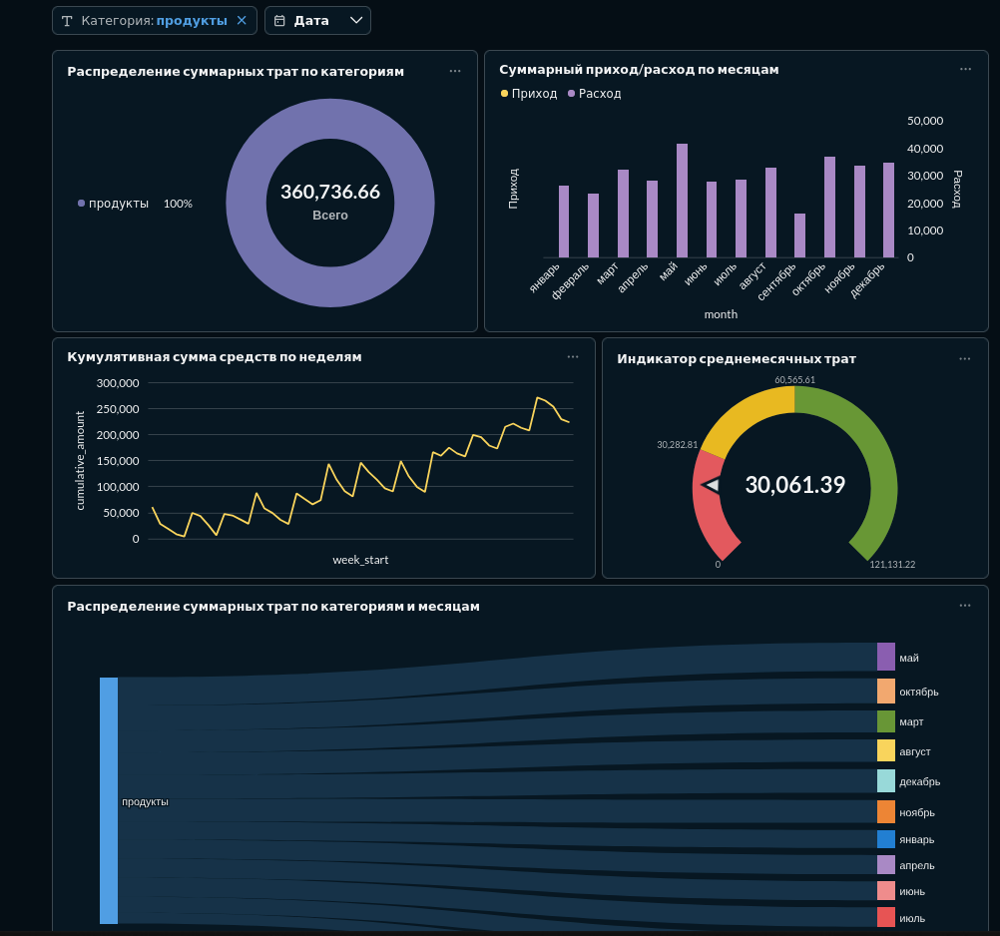
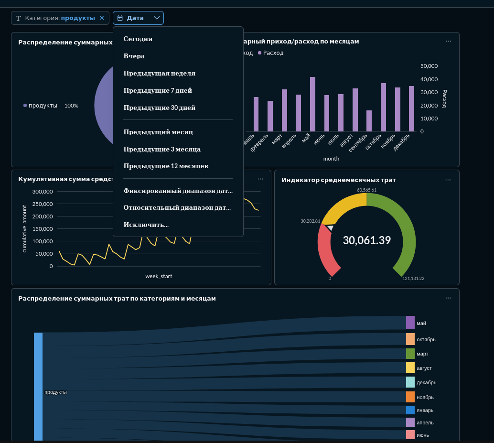
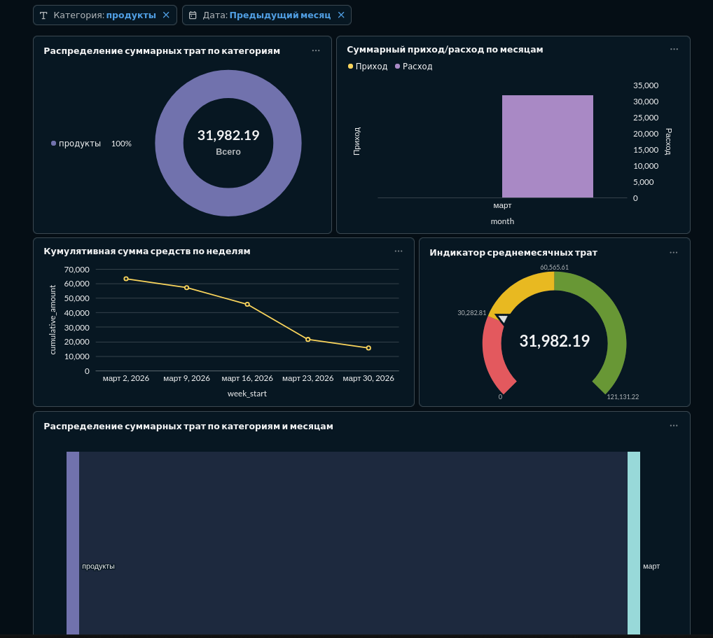

### Помечание
- В запросах в таких скобках `[[and {{имя переменной}}]]` отвечают за фильтры, в моем случае `date_filter` и `category_filter`

Настройки:


### Распределение суммарных трат по категориям 

Запрос:

```mysql
select
    category,
    sum(amount) as total_expense
from transactions_raw_20260420051628
where type = 'списание'
[[and {{category_filter}}]]
[[and {{date_filter}}]]
group by category
order by total_expense desc;
````

График



### Суммарный приход/расход по месяцам

Запрос

```mysql
select
    case `month_num`
        when 1 then 'январь'
        when 2 then 'февраль'
        when 3 then 'март'
        when 4 then 'апрель'
        when 5 then 'май'
        when 6 then 'июнь'
        when 7 then 'июль'
        when 8 then 'август'
        when 9 then 'сентябрь'
        when 10 then 'октябрь'
        when 11 then 'ноябрь'
        when 12 then 'декабрь'
    end as `month`,
    `Приход`,
    `Расход`
from (
    select
        month(`date`) as `month_num`,
        sum(case when `type` = 'пополнение' then `amount` else 0 end) as `Приход`,
        sum(case when `type` = 'списание' then `amount` else 0 end) as `Расход`
    from `transactions_raw_20260420051628`
    where 1 = 1
    [[and {{category_filter}}]]
	[[and {{date_filter}}]]
    group by
        month(`date`)
) t
order by
    `month_num`;
```

График:



### Куммулятивная сумма средств по неделям

Запрос:

```mysql
select
    `week_start`,
    sum(`period_net_amount`) over (order by `week_start`) as `cumulative_amount`
from (
    select
        `week_start`,
        sum(`daily_net_amount`) as `period_net_amount`
    from (
        select
            date_sub(`day_date`, interval weekday(`day_date`) day) as `week_start`,
            `daily_net_amount`
        from (
            select
                date(`date`) as `day_date`,
                sum(
                    case
                        when `type` = 'пополнение' then `amount`
                        when `type` = 'списание' then -`amount`
                        else 0
                    end
                ) as `daily_net_amount`
            from `transactions_raw_20260420051628`
            where 1 = 1
            [[and {{date_filter}}]]
            group by
                date(`date`)
        ) t1
    ) t2
    group by
        `week_start`
) t3
order by
    `week_start`;
```

График:



### Индикатор среднемесячных трат

Запрос:

```mysql
select
    round(avg(`monthly_expense`), 2) as `average_monthly_expense`
from (
    select
        year(`date`) as `year_num`,
        month(`date`) as `month_num`,
        sum(`amount`) as `monthly_expense`
    from `transactions_raw_20260420051628`
    where `type` = 'списание'
    [[and {{category_filter}}]]
	[[and {{date_filter}}]]
    group by
        year(`date`),
        month(`date`)
) t;
```

График:



### Распределения суммарных трат по категориям и месяцам

Запрос:

```mysql
select
    `category`,
    case `month_num`
        when 1 then 'январь'
        when 2 then 'февраль'
        when 3 then 'март'
        when 4 then 'апрель'
        when 5 then 'май'
        when 6 then 'июнь'
        when 7 then 'июль'
        when 8 then 'август'
        when 9 then 'сентябрь'
        when 10 then 'октябрь'
        when 11 then 'ноябрь'
        when 12 then 'декабрь'
    end as `month`,
    `total_expense`
from (
    select
        month(`date`) as `month_num`,
        `category`,
        sum(`amount`) as `total_expense`
    from `transactions_raw_20260420051628`
    where `type` = 'списание'
    [[and {{category_filter}}]]
	[[and {{date_filter}}]]
    group by
        month(`date`),
        `category`
) t
order by
    `month_num`,
    `category`;
```

График:



### Дашборд



#### Экшен-фильтр



* К сожалению по дате не получилось сделать, почему то, он работает только если вручную выбирать дату




